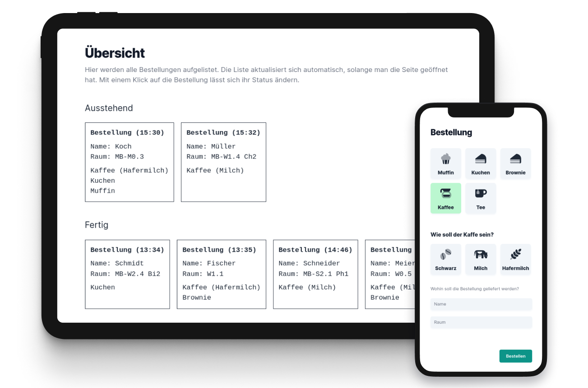

# Dulcis



## Was ist das?

Dulcis – eine benutzerfreundliche Web-App für Tee, Kaffee und Kuchen-Bestellungen. Während des letzten Elternsprechtags ermöglichte Dulcis Lehrern, sich direkt Leckereien direkt zu ihren Räumen zu bestellen. Einfach Namen und Raum eingeben, Kaffe und Kuchen wählen und der Abijahrgang konnte die Bestellungen in Echtzeit verfolgen. Schnell, einfach und effizient für Lehrer und Schüler.

## Installation

Mit folgenden Schritten kann man Dulcis auch lokal auf dem eigenen Rechner starten:

```
# Dulcis-Repo klonen
$ git clone git@github.com:xp4u1/dulcis

# Pakete herunterladen
$ yarn

# Supabase Daten anpassen
$ vim ./src/data/Supabase.ts

# App im Entwicklungsmodus starten
$ yarn dev
```
